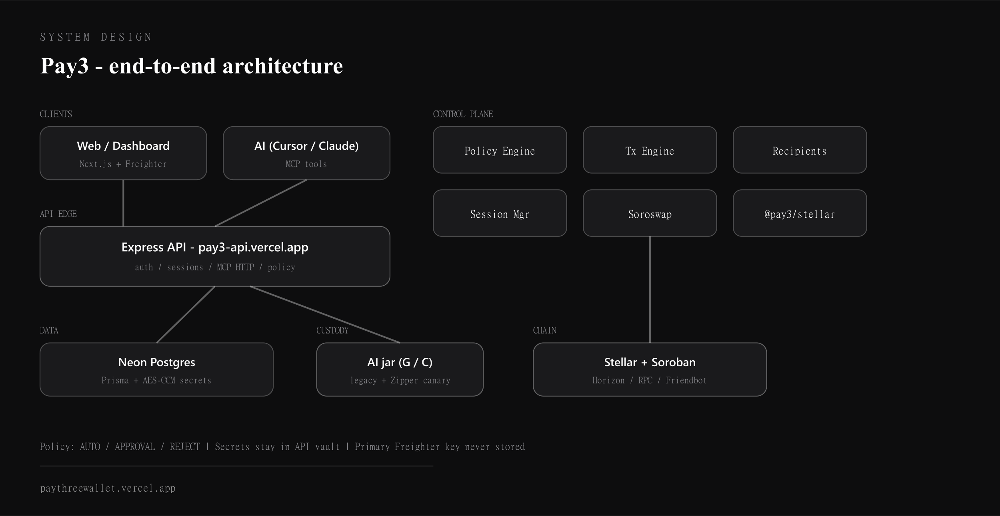
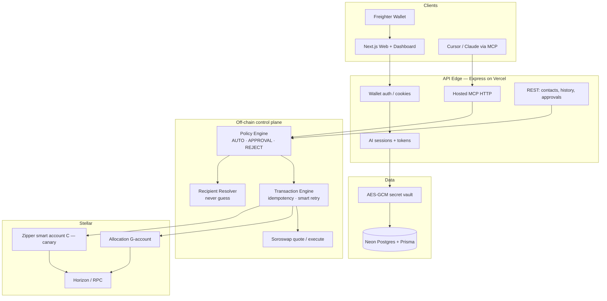
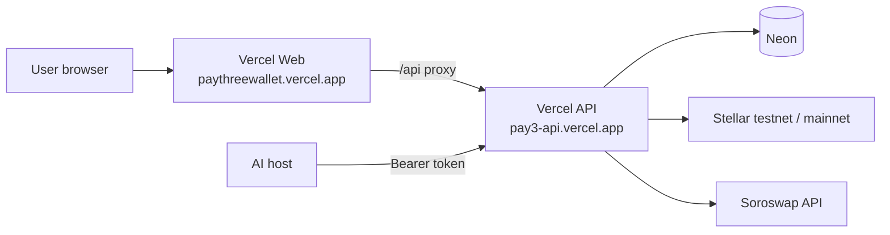
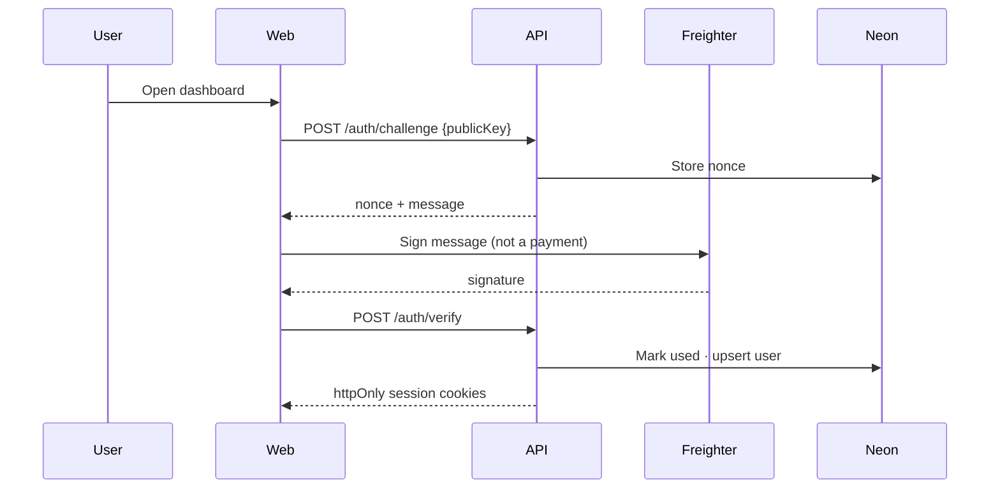
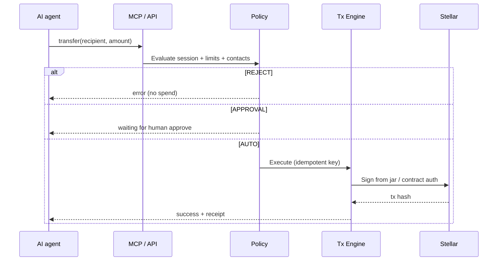

<div align="center">


# Pay3

### Delegate. Validate. Execute.

**Safe allowance for AI money on Stellar** — MCP-powered finance without handing your Freighter key to a model.

You keep the big wallet. The AI spends from a **small pot** with **rules you set**.

<br/>

<a href="https://paythreewallet.vercel.app"></a>
<a href="https://pay3-api.vercel.app/health"></a>
<a href="https://x.com/PAYThreeWallet"></a>
<a href="https://github.com/debuuuuuu/PAY3"></a>
<a href="docs/WHAT_IS_PAY3.md"></a>
<a href="docs/readme.html"></a>

<br/>

<p>
  <a href="https://paythreewallet.vercel.app"><strong>Website</strong></a>
  ·
  <a href="https://pay3-api.vercel.app/health"><strong>API</strong></a>
  ·
  <a href="https://x.com/PAYThreeWallet"><strong>X @PAYThreeWallet</strong></a>
  ·
  <a href="https://github.com/debuuuuuu/PAY3"><strong>GitHub</strong></a>
  ·
  <a href="mailto:pay3wallet@gmail.com"><strong>Contact</strong></a>
  ·
  <a href="docs/readme.html"><strong>HTML README</strong></a>
</p>

</div>

---

<details open>
<summary><strong>Table of contents</strong></summary>

1. [What is Pay3?](#what-is-pay3)
2. [Why it exists](#why-it-exists)
3. [System design](#system-design)
4. [Request lifecycle](#request-lifecycle)
5. [Monorepo map](#monorepo-map)
6. [Custody model](#custody-model)
7. [MCP tools](#mcp-tools)
8. [Security house rules](#security-house-rules)
9. [Tech stack](#tech-stack)
10. [Quick start](#quick-start)
11. [Production](#production)
12. [Community & links](#community--links)
13. [Documentation](#documentation)
14. [Status](#status)

</details>

---

## What is Pay3?

<table>
<tr>
<td width="55%">

**One sentence:** Pay3 is the **security layer between AI and money**.

Someone can tell Cursor or Claude: *“Pay Alice 1 XLM”* — and funds move on Stellar **only** if:

- the money is in the **AI jar** (not your main wallet),
- the **session** allows it,
- the **policy engine** says AUTO (or you approve),
- the **recipient** is unambiguous.

</td>
<td width="45%">

| Actor | Role |
|:------|:-----|
| **You** | Own Freighter, set rules, fund jar |
| **AI** | Calls MCP tools with a hall-pass token |
| **Pay3 API** | Auth, policy, signing, audit |
| **Stellar** | Settlement |

</td>
</tr>
</table>

> New here? Read the plain-language story: **[`docs/WHAT_IS_PAY3.md`](docs/WHAT_IS_PAY3.md)**  
> Prefer a glossy page with full CSS motion? Open **[`docs/readme.html`](docs/readme.html)** in a browser.

---

## Why it exists

AI agents can chat — but payment rails were built for humans with credit cards and monthly SaaS.

| Old world | Pay3 world |
|:----------|:-----------|
| Give the bot your whole wallet | Give the bot a **limited jar** |
| Guess who “Alex” is | **Reject** ambiguous names |
| Hope the model behaves | **Policy** + expiry + revoke |
| Keys in prompts / frontends | Keys **encrypted at rest**, used only in API memory |

**Public beta today = Stellar testnet.** Play money first. Mainnet / USDC are not the casual default path yet.

---

## System design

<div align="center">

</div>

### High-level boxes



### Deployment topology



Same-origin `/api` proxy keeps Freighter session cookies first-party.

---

## Request lifecycle

### Human login



### AI payment (MCP)



### Policy decisions

| Result | Meaning |
|:-------|:--------|
| **AUTO** | Within limits → execute |
| **APPROVAL** | Needs human tap (expires ~2 min) |
| **REJECT** | Hard no — **do not** financial-retry |

Technical / RPC blips may retry (capped). Insufficient funds, policy deny, expired session → **no auto money retry**.

---

## Monorepo map

```text
pay3/
├── apps/
│   ├── web/              Next.js — landing (GSAP), dashboard, guide
│   ├── api/              Express — auth, sessions, MCP HTTP, swaps
│   └── mcp-server/       stdio MCP for local Cursor / Claude Desktop
├── packages/
│   ├── database/         Prisma schema → Neon
│   ├── policy-engine/    3-level AUTO / APPROVAL / REJECT
│   ├── session-manager/  AI session lifecycle
│   ├── transaction-engine/
│   ├── recipient-resolver/
│   ├── stellar/          Horizon, Friendbot, Soroban helpers
│   └── shared/           types & constants
├── contracts/
│   └── smart-account/    Soroban Zipper (Protocol 27 / CAP-71)
├── docs/                 WHAT_IS_PAY3, architecture, security, …
│   ├── assets/           Animated SVG banners + system diagram
│   └── readme.html       Full CSS interactive README
└── scripts/              deploy, smoke, canary
```

| Path | Responsibility |
|:-----|:---------------|
| `apps/web` | UI only — no business secrets |
| `apps/api` | Trust boundary for money |
| `packages/*` | Engines reusable / testable |
| `contracts/smart-account` | On-chain `__check_auth` + sessions as Zipper delegates |

---

## Custody model

<div align="center">

| Layer | What | Default today |
|:------|:-----|:--------------|
| **Primary** | Freighter G-address | Never stored by Pay3 |
| **AI jar (legacy)** | Separate G-account, secret AES-GCM in Neon | ✅ Default |
| **AI jar (Zipper)** | Soroban C-account, CAP-71 delegates | 🟡 Opt-in canary |

</div>

```text
Freighter (you)  ──manual fund──►  Allocation G… or Contract C…
                                         │
                                         ▼
                              AI session (encrypted key + policy + expiry)
                                         │
                                         ▼
                              MCP tools (balance / transfer / swap / history)
```

Rebuild WASM → refresh `PAY3_ALLOWED_WASM_HASHES`. See [`docs/SOROBAN_SETUP.md`](docs/SOROBAN_SETUP.md).

---

## MCP tools

Hosted: `POST https://pay3-api.vercel.app/mcp` with `Authorization: Bearer <session token>`.

| Tool | Kind | Notes |
|:-----|:-----|:------|
| `get_balance` | Read | Jar balance |
| `get_transaction_history` | Read | Recent txs |
| `transfer` | Spend | Contacts / address; policy gated |
| `get_swap_quote` | Read | Soroswap quote |
| `execute_swap` | Spend | **Opt-in** permission; network must align |

Setup: [`docs/MCP_SETUP.md`](docs/MCP_SETUP.md)

---

## Security house rules

These are non-negotiable (see [`docs/SECURITY.md`](docs/SECURITY.md)):

<table>
<tr><td>🚫</td><td>Never store the user's <strong>primary</strong> Freighter private key</td></tr>
<tr><td>🚫</td><td>Never expose AI session secrets to frontend, models, or API responses</td></tr>
<tr><td>🚫</td><td>Never guess ambiguous recipients — reject and ask</td></tr>
<tr><td>🚫</td><td>Never auto-retry financial failures (funds / policy / expired session)</td></tr>
<tr><td>✅</td><td>Every session expires and is individually revocable</td></tr>
<tr><td>✅</td><td>Every spend passes policy; transfers are idempotent</td></tr>
<tr><td>✅</td><td>Main wallet funds stay isolated from the AI jar</td></tr>
</table>

---

## Tech stack

<table>
<tr>
<td>

**Product**
- Next.js (App Router)
- Express API
- Prisma + Neon Postgres
- Freighter wallet auth

</td>
<td>

**Money**
- Stellar (testnet beta)
- Horizon + Soroban RPC
- Soroswap aggregator
- Zipper / Protocol 27 contract

</td>
<td>

**AI**
- MCP (stdio + hosted HTTP)
- Session tokens
- Policy + approvals UX

</td>
</tr>
</table>

---

## Quick start

### Local

```bash
npm install
cp .env.example apps/api/.env    # DATABASE_URL + SMART_ACCOUNT_ENCRYPTION_KEY
cp .env.example apps/web/.env

npm run db:generate
npm run db:push

npm run dev          # http://localhost:3000
npm run dev:api      # http://localhost:4000
```

### MCP (Cursor)

```bash
npm run build:mcp
copy .cursor\mcp.json.example .cursor\mcp.json   # paste pay3_… token
$env:PAY3_MCP_TOKEN="pay3_…"
npm run smoke:mcp
```

### Smokes

```bash
node scripts/smoke-prod.mjs
npm run smoke:stellar
```

---

## Production

| Service | URL |
|:--------|:----|
| Web | https://paythreewallet.vercel.app |
| API | https://pay3-api.vercel.app |
| Health | https://pay3-api.vercel.app/health |

Deploy notes: [`docs/PRODUCTION.md`](docs/PRODUCTION.md)  
API deploy helper: `node scripts/deploy-api-vercel.mjs`

---

## Community & links

<div align="center">

| | |
|:--|:--|
| **X (Twitter)** | [@PAYThreeWallet](https://x.com/PAYThreeWallet) |
| **GitHub** | [debuuuuuu/PAY3](https://github.com/debuuuuuu/PAY3) · branch `deb` |
| **Website** | [paythreewallet.vercel.app](https://paythreewallet.vercel.app) |
| **API** | [pay3-api.vercel.app](https://pay3-api.vercel.app/health) |
| **Email** | [pay3wallet@gmail.com](mailto:pay3wallet@gmail.com) |
| **Interactive docs** | [`docs/readme.html`](docs/readme.html) |

<br/>

<a href="https://x.com/PAYThreeWallet">
  
</a>

<p><sub>Follow product updates → <a href="https://x.com/PAYThreeWallet">x.com/PAYThreeWallet</a></sub></p>

</div>

---

## Documentation

| Doc | Audience |
|:----|:---------|
| [`docs/readme.html`](docs/readme.html) | **Interactive HTML + CSS** overview |
| [`docs/WHAT_IS_PAY3.md`](docs/WHAT_IS_PAY3.md) | Anyone (kid-friendly) |
| [`docs/ARCHITECTURE.md`](docs/ARCHITECTURE.md) | System flow |
| [`docs/STATUS_REPORT.md`](docs/STATUS_REPORT.md) | What’s built |
| [`docs/SECURITY.md`](docs/SECURITY.md) | Checklist |
| [`docs/MCP_SETUP.md`](docs/MCP_SETUP.md) | Connect AI |
| [`docs/DATABASE.md`](docs/DATABASE.md) | Neon / Prisma |
| [`docs/SOROBAN_SETUP.md`](docs/SOROBAN_SETUP.md) | Contract build |
| [`docs/TECHNICAL_VALIDATION.md`](docs/TECHNICAL_VALIDATION.md) | Soroban decisions |
| [`docs/PROJECT_CONTEXT.md`](docs/PROJECT_CONTEXT.md) | Long-term vision |
| [`docs/IMPLEMENTATION_PLAN.md`](docs/IMPLEMENTATION_PLAN.md) | Phases |

### Stellar docs (for humans + AI)

Official machine-readable index: **[developers.stellar.org/llms.txt](https://developers.stellar.org/llms.txt)**  
Full dump: [llms-full.txt](https://developers.stellar.org/llms-full.txt) · live docs MCP: [Raven](https://raven.stellar.buzz/mcp)

| Topic Pay3 cares about | Link |
|:------------------------|:-----|
| Contract accounts | [guides/contract-accounts](https://developers.stellar.org/docs/build/guides/contract-accounts.md) |
| Contract authorization | [guides/auth](https://developers.stellar.org/docs/build/guides/auth.md) |
| Freighter | [guides/freighter](https://developers.stellar.org/docs/build/guides/freighter.md) |
| SAC / tokens | [tokens/stellar-asset-contract](https://developers.stellar.org/docs/tokens/stellar-asset-contract.md) |
| Building with AI | [build/building-with-ai](https://developers.stellar.org/docs/build/building-with-ai.md) |
| Smart contracts start | [smart-contracts/getting-started](https://developers.stellar.org/docs/build/smart-contracts/getting-started.md) |

Any Stellar docs page also serves markdown via `Accept: text/markdown` or by appending `.md` to the URL.

---

## Status

**Testnet beta** — Freighter → jar → contacts → session → policy → MCP pay → approvals / revoke / audit.

| Area | State |
|:-----|:------|
| Off-chain MVP (auth → MCP) | ✅ |
| Soroswap quote / execute | ✅ (pools / network dependent) |
| Zipper WASM + canary path | ✅ code; opt-in deploy |
| Contract custody default | ❌ not yet |
| Mainnet as casual default | ❌ not yet |

---

<div align="center">


<br/>

**If unsure, Pay3 says no — that is a feature.**

<br/>

<a href="https://x.com/PAYThreeWallet">X</a>
·
<a href="https://github.com/debuuuuuu/PAY3">GitHub</a>
·
<a href="https://paythreewallet.vercel.app">Website</a>
·
<a href="docs/readme.html">HTML README</a>

<br/><br/>

<sub>Full CSS experience → <a href="docs/readme.html">docs/readme.html</a>. Live site → <a href="https://paythreewallet.vercel.app">paythreewallet.vercel.app</a>.</sub>

</div>
