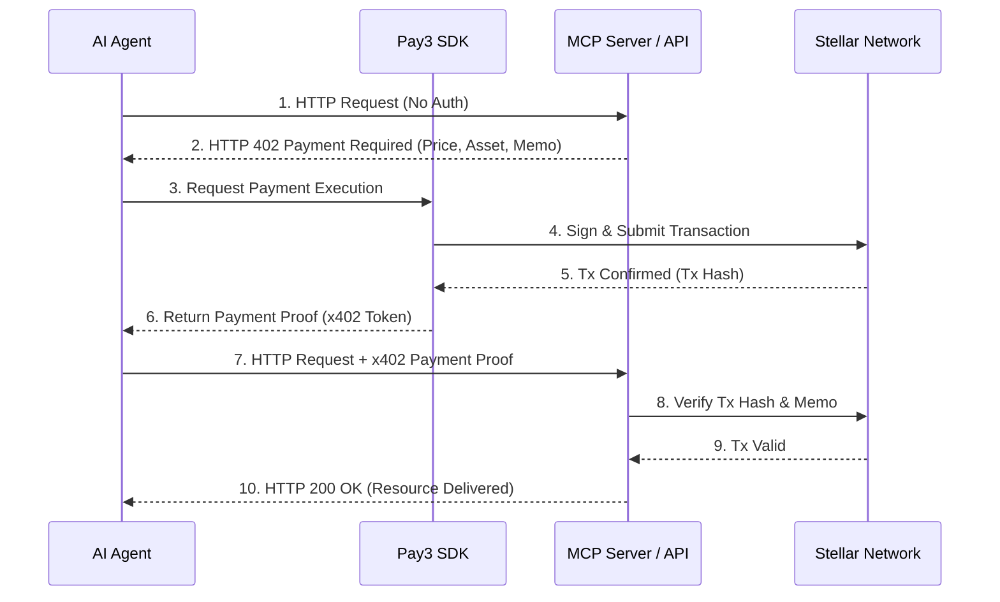

# Pay3 — Project Context & Technical Specification

> **Version:** 1.1
> **Status:** Active / Vision & Product Context
> **Last Updated:** July 2026
> **Purpose:** This document is the single source of truth for the Pay3 project. Any AI assistant, developer, or contributor must read and adhere to this document before making architectural, design, or implementation decisions.

---

## 1. Vision

**Pay3 is the autonomous payment layer for the AI economy.**

It is a Stellar-native payment infrastructure that enables autonomous AI agents to securely discover, purchase, and consume paid digital services without human intervention. By providing programmable wallets, policy-controlled spending, and seamless micropayments via the **x402 protocol**, Pay3 removes the friction of human-centric billing.

Rather than requiring humans to manage API keys, subscriptions, or credit cards, Pay3 allows AI agents to pay *only for what they use*, strictly adhering to predefined budgets and security policies.

---

## 2. Problem Statement

Today's payment and authentication systems are designed exclusively for humans. Modern AI agents cannot independently participate in the digital economy because they cannot:

* Own and manage programmable wallets.
* Autonomously purchase APIs or compute resources.
* Enforce complex spending limits and security policies.
* Cryptographically verify payments and receipts.
* Discover and interact with monetized MCP (Model Context Protocol) servers.

Current systems rely on credit cards, static API keys, monthly SaaS subscriptions, and manual human approval. **These models do not scale to autonomous software agents.** Pay3 solves this by introducing a machine-native payment infrastructure.

---

## 3. Mission

**Build the financial infrastructure that enables AI agents to become autonomous economic participants.**

Every AI agent should be able to:
* **Own** assets (via Stellar keypairs).
* **Spend** assets (via x402 micropayments).
* **Earn** assets (by providing services/tools).
* **Verify** transactions (cryptographic proof of payment).
* **Discover** paid tools (via the API/MCP Marketplace).
* **Obey** programmable financial policies (budgets, allowlists).

---

## 4. Target Users

### 1. AI Agents (Primary Consumers)
* *Examples:* Personal assistants, coding agents, research bots, workflow automations.
* *Needs:* Frictionless, programmatic payment execution, identity management, and strict adherence to spending policies.

### 2. Developers & AI Builders
* *Needs:* SDKs, clear APIs, robust documentation, wallet management tools, and sandbox environments for testing agent transactions.

### 3. API & MCP Server Providers
* *Needs:* Easy monetization of endpoints, usage tracking, automated payment verification, analytics, and revenue management without building custom billing systems.

### 4. Enterprises
* *Needs:* Organization-level wallets, strict spending controls, compliance, policy management, and immutable audit logs for autonomous AI deployments.

---

## 5. Glossary of Core Terms

* **Stellar Network:** The underlying Layer-1 blockchain providing fast, low-cost settlement and native asset support.
* **x402 Protocol:** An HTTP-based payment protocol utilizing the `402 Payment Required` status code. It enables stateless, pay-per-request micropayments where the client pays, receives a cryptographic receipt, and immediately accesses the resource.
* **MCP (Model Context Protocol):** An open standard for connecting AI agents to external data and tools. Pay3 acts as the monetization layer for MCP servers.
* **Agent Identity:** A cryptographic identity (Stellar keypair) uniquely representing an AI agent, allowing it to sign transactions and prove ownership.

---

## 6. Technology Stack

### Blockchain Layer
* **Network:** Stellar Network (Public/Testnet).
* **Why:** 3-5 second finality, fractions of a penny in fees, native multi-asset support, and a mature developer ecosystem.

### Payment Protocol
* **Protocol:** x402 (HTTP 402 Payment Required).
* **Use Case:** Stateless API payments, pay-per-token micropayments, and autonomous machine-to-machine (M2M) transactions.

### AI & Integration Layer
* **Protocols:** MCP (Model Context Protocol) compatible.
* **Frameworks:** Designed to integrate seamlessly with LangChain, AutoGen, CrewAI, and custom agent loops.

---

## 7. High-Level Architecture & Flow

### 7.1 System Interaction Flow (x402 Payment)

### 7.2 Core Components
* **Frontend:** Dashboard for humans to manage agent wallets, view analytics, configure policies, and browse the marketplace.
* **Backend (Orchestrator):** Handles authentication, policy enforcement, budget tracking, and API routing.
* **Wallet Service:** Manages Stellar account creation, keypair encryption, balance tracking, and multi-sig setups.
* **Payment Engine:** Implements the x402 protocol, generates payment challenges, verifies receipts, and handles refunds.
* **Policy & Budget Engine:** The "brain" that blocks or allows transactions based on daily limits, API allowlists, and risk rules.
* **Marketplace:** A registry of monetized APIs and MCP servers, complete with pricing metadata and documentation.

---

## 8. Core Domain Entities

1. **Organization / User:** The human or entity that owns the infrastructure.
2. **Agent:** An autonomous identity (linked to a specific Stellar public key) with assigned policies.
3. **Wallet:** A Stellar account holding assets. Can be linked to multiple agents (with spending limits).
4. **Policy:** A set of rules (e.g., `max_spend_per_day: 10 XLM`, `allowed_domains: ['api.openai.com']`).
5. **Transaction:** A record of a payment, linking a Stellar tx hash, an Agent, a Wallet, and the specific API endpoint consumed.

---

## 9. Major Product Features

### Identity & Wallets
* Agent identity generation (Stellar keypairs).
* Wallet creation, funding, and backup.
* Multi-asset balance tracking (XLM, USDC, etc.).

### Payments & x402
* Automated x402 challenge/response handling.
* Micropayment batching (to save on network fees if applicable).
* Cryptographic receipt generation and verification.

### Policy & Budget Management
* Hard and soft spending limits (Daily/Monthly/Per-API).
* Allowlists and blocklists for domains/endpoints.
* Human-in-the-loop approval workflows for high-value transactions.

### API & MCP Marketplace
* Discovery of paid tools and MCP servers.
* Standardized pricing metadata.
* Provider onboarding and revenue dashboards.

### Dashboard & Analytics
* Real-time wallet and spending overview.
* Agent activity logs and cost attribution.
* Provider revenue analytics.

---

## 10. Security & Non-Functional Requirements

### Security Goals (Priority #1)
* **Secret Management:** Private keys must never be stored in plain text. Use HSMs or robust encryption (e.g., AES-256) at rest.
* **Agent Isolation:** Compromised agents must not be able to drain the parent organization's wallet.
* **Replay Protection:** x402 payment proofs must include nonces/timestamps to prevent replay attacks.
* **Auditability:** Every policy decision (approve/deny) and transaction must be immutably logged.

### Non-Functional Requirements
* **Modularity:** Microservices or well-defined modular monolith.
* **Performance:** < 500ms latency for policy checks; < 5s for Stellar settlement.
* **Observability:** Distributed tracing, structured logging, and Prometheus metrics.
* **Extensibility:** Easy to add new blockchain networks or payment protocols in the future.

---

## 11. MVP Scope (Phase 1)

- [ ] User/Agent Authentication.
- [ ] Stellar Testnet/Mainnet wallet creation and funding.
- [ ] Basic x402 payment flow (Agent pays API, API verifies).
- [ ] Human dashboard for wallet overview and transaction history.
- [ ] Basic Policy Engine (Hard daily spend limits, domain allowlists).
- [ ] REST API for all core functions.
- [ ] TypeScript/Python SDK for AI agents.
- [ ] Comprehensive Developer Documentation.

*Anything outside this list is Phase 2+.*

---

## 12. Future Vision (Phase 2 & Beyond)

* **Streaming Payments:** Pay-by-the-second for continuous API usage.
* **Multi-Chain Support:** Expand beyond Stellar to Solana, Base, or Arbitrum for specific asset ecosystems.
* **Escrow & Dispute Resolution:** For high-value, long-running agent tasks.
* **AI Reputation System:** On-chain reputation for reliable API providers and trustworthy agents.
* **Decentralized Identity (DID):** Moving agent identities to W3C DIDs.
* **Browser Extension & Mobile:** For human oversight and quick approvals.

---

## 13. Engineering Principles

1. **AI-First Design:** APIs and SDKs must be easily parsable and usable by LLMs, not just humans.
2. **Modularity over Monolith:** Keep business logic, blockchain interaction, and UI strictly separated.
3. **Design APIs First:** Define the OpenAPI/GraphQL schema before writing implementation code.
4. **Security by Default:** Assume the network is hostile. Validate all inputs, verify all signatures.
5. **Developer Experience (DX):** If an integration takes more than 5 minutes, the SDK is failing.
6. **Avoid Premature Optimization:** Build for the MVP first, but design the interfaces to support the Future Vision.
7. **Treat this Document as Law:** If code conflicts with this document, the code is wrong. Update the document if the vision changes.

---

## 14. Source of Truth & Conflict Resolution

1. **This Document (`docs/PROJECT_CONTEXT.md`)** — The canonical product vision.
2. **The Roadmap (`docs/master_task.md`)** — The immediate execution plan.
3. **Architecture Decision Records (`docs/adr/`)** — Specific technical choices made during development.
4. **Core Directives:** Preserve modularity, security, and scalability. If a conflict exists, prioritize the long-term vision of Pay3 as the payment infrastructure for autonomous AI agents.
