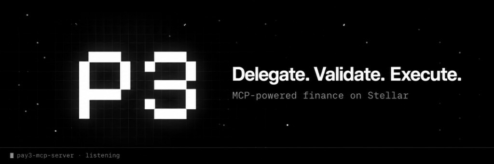
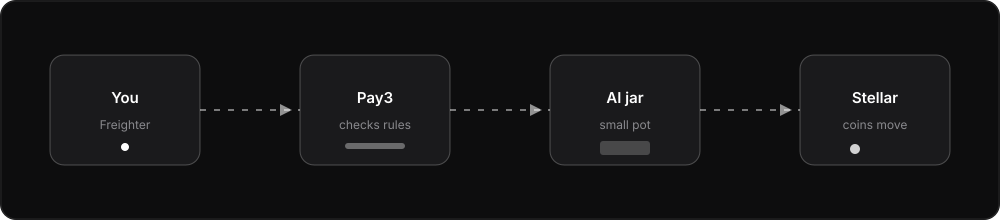
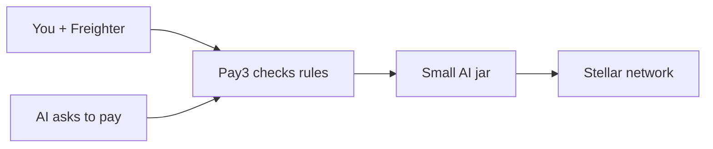

# What is Pay3? (explained simply)

<div align="center">


<br/><br/>

  

<p>
  <a href="https://x.com/PAYThreeWallet"><strong>X @PAYThreeWallet</strong></a>
  ·
  <a href="https://paythreewallet.vercel.app"><strong>Website</strong></a>
  ·
  <a href="https://github.com/debuuuuuu/PAY3"><strong>GitHub</strong></a>
</p>

</div>

> **Who this is for:** anyone — including someone who has never heard of crypto, AI, or “MCP.”  
> **Hard docs:** start here first. Technical details live in the other files linked at the bottom.

---

## The one-sentence version

**Pay3 is a safe allowance for your AI.**

You keep your real money. You give the AI a small pot and clear rules. The AI can pay people (and check balances) **only** with that pot and those rules — never with your main wallet.

---

## A story (like a kid’s allowance)

Imagine you have:

1. **A big piggy bank at home** — your real wallet (Freighter). Mom and Dad would never hand the whole house keys to a robot.
2. **A small jar on the table** — money you chose to put aside for the robot.
3. **A note on the jar** — rules like “max $5 a day,” “only pay friends on the list,” “ask me if it’s big.”
4. **A robot helper** (Cursor, Claude, etc.) that can read the note and use the jar — but **cannot** open the big piggy bank.

That robot helper talks to Pay3. Pay3 checks the note. If the rules say yes, money moves. If not, Pay3 says **no**.

<p align="center">
  
</p>



---

## Why does this exist?

Computers that chat (AI) are getting smart enough to do chores for you: “pay my friend,” “check my balance,” “swap coins.”

But money is dangerous.

- If you give the AI **all** your wallet keys, a mistake (or a bad prompt) could empty everything.
- Old payment systems (credit cards, monthly subscriptions) were built for **humans clicking buttons**, not for robots paying tiny amounts many times.

Pay3’s job: **let AI use money without becoming a burglar.**

---

## Who is it for?

| Who | What they want |
|-----|----------------|
| **You** | Connect a wallet, set rules, sleep easier |
| **Your AI** | Call simple tools: balance, pay, history, sometimes swap |
| **Builders** | Plug agents into payments without reinventing security |

---

## The big pieces (still simple)

### 1. Stellar — the money street

Stellar is a fast, cheap network for moving digital coins (like XLM).  
Think: a special street where coins can walk from one address to another in a few seconds.

Pay3 uses **testnet** a lot — that’s **play money** so nobody loses real cash while we build.

### 2. Freighter — your big piggy bank

A browser wallet. You prove “this is me” by **signing a short message** (like signing your name on a school form).  
Pay3 **never** takes or stores your Freighter private key.

### 3. The small jar — AI money pot

After login you **link** an allocation account (a separate Stellar address).

- You send **only what you’re okay losing / testing** into that jar.
- The AI spends from **that** address.
- Secret keys for that jar are **locked in a vault** (encrypted in the database). The AI and the website never get to read them.

Later we also have a **smart lock** (Soroban / Zipper contract) that can enforce rules **on the blockchain** for special canary accounts. Default today is still the simpler jar.

### 4. Contacts — name tags, not guessing

You save “Alice → her address.”  
If the AI says “pay Alice” and there are **two** Alices, Pay3 **stops** and asks.  
We never guess who you meant. Guessing wrong with money is bad.

### 5. Sessions — a temporary hall pass

When you create an **AI session**, you get a token (like a hall pass).

- It expires.
- You can revoke it.
- You pick what the pass allows (pay? swap? only look?).

You paste that token into Cursor / Claude so the AI can talk to Pay3.

### 6. Policy engine — the school teacher

Before any payment, Pay3 asks:

- Is this action allowed on the hall pass?
- Is it under the daily / per-payment limit?
- Is the person on the contact list (when a name is used)?
- Does this need **you** to tap Approve?

Answers:

- **AUTO** — go ahead  
- **APPROVAL** — wait for you  
- **REJECT** — no

### 7. MCP — the robot’s walkie-talkie

**MCP** (Model Context Protocol) is how tools show up inside AI apps.

Pay3’s tools look like:

| Tool | Kid meaning |
|------|-------------|
| `get_balance` | “How much is in the jar?” |
| `transfer` | “Send coins to someone.” |
| `get_transaction_history` | “What did we spend?” |
| `get_swap_quote` | “How many B coins for my A coins?” (look only) |
| `execute_swap` | “Actually trade A for B.” (only if you allowed it) |

Hosted API: `https://pay3-api.vercel.app`  
Website: `https://paythreewallet.vercel.app`

### 8. Database (Neon) — the school notebook

Remembers users, jars, contacts, sessions, and audit logs so restarts don’t erase your setup.

---

## How a payment works (step by step)

1. You log in with Freighter.  
2. You link and fund the small jar.  
3. You add contacts.  
4. You create a session and set rules.  
5. You give the AI the session token.  
6. You say: *“Pay Alice 1 XLM.”*  
7. AI calls Pay3 → Pay3 checks rules → if OK, signs and sends on Stellar.  
8. You can see it in History / audit.

If something is weird (too much money, unknown name, expired pass), Pay3 **refuses**. It does **not** keep retrying money failures forever.

---

## Safety house rules (must never break)

These are the “don’t touch the stove” rules:

1. **Never** store your main Freighter private key.  
2. **Never** show AI session secrets to the AI or the website.  
3. **Never** guess who “Alex” is if there are two Alexes.  
4. **Never** auto-retry “not enough money” or “policy said no.”  
5. Keep **most** money in Freighter; only put **allowance** in the jar.  
6. Every money move should be **checkable** later (audit).

More checklist detail: [`SECURITY.md`](./SECURITY.md).

---

## What’s real today vs later

### Working now (testnet beta)

- Website + dashboard  
- Freighter login  
- Small jar (allocation account)  
- Contacts  
- AI sessions + revoke  
- Policy + transfers via MCP  
- Approvals / emergency stop patterns  
- Swap **quotes** (and execute when networks match and pools exist)  
- Zipper smart-account **code + WASM** (opt-in canary, not default)

### Not the everyday default yet

- Mainnet as the “safe casual” path for everyone  
- Full x402 “pay the website 402 style” marketplace from the old vision doc  
- Contract custody for **every** new user (still opt-in)

Vision / long-term dream: [`PROJECT_CONTEXT.md`](./PROJECT_CONTEXT.md)  
Builder status: [`STATUS_REPORT.md`](./STATUS_REPORT.md)

---

## Words you might hear (tiny dictionary)

| Fancy word | Plain meaning |
|------------|----------------|
| **Wallet** | A place that holds coins + keys |
| **Public key / G-address** | The “mailing address” for coins (safe to share) |
| **Private key / secret** | The password that spends coins (never share) |
| **XLM** | Stellar’s coin |
| **Testnet** | Playground with fake coins |
| **Mainnet** | Real network with real value |
| **MCP** | How AI apps plug into tools |
| **Policy** | The rules on the jar |
| **Soroban** | Stellar’s smart contracts (programmable locks) |
| **Zipper** | New Stellar way for “helpers may sign for me” (CAP-71) |
| **Allocation** | Your AI’s small jar |
| **Session** | Temporary hall pass for one AI |

---

## Where the code lives (toy map)

```
Pay3 repo
├── apps/web/        → pictures & buttons (website)
├── apps/api/        → brain (checks rules, moves money)
├── apps/mcp-server/ → walkie-talkie for local AI apps
├── packages/        → Lego bricks (policy, stellar, database…)
├── contracts/       → on-chain smart lock (Zipper account)
└── docs/            → explanations (you are here)
```

---

## Try it (grown-up clicks, kid steps)

1. Open https://paythreewallet.vercel.app  
2. Connect Freighter (testnet).  
3. Link the smart / allocation account.  
4. Put a little test XLM in the jar.  
5. Add a contact.  
6. Create an AI session → copy token.  
7. Put the token in Cursor MCP (see [`MCP_SETUP.md`](./MCP_SETUP.md)).  
8. Ask the AI: “What’s my Pay3 balance?”

Local run for developers: see root [`README.md`](../README.md).

---

## If you remember only three things

1. **Pay3 = allowance + rules for AI money.**  
2. **Big piggy bank stays yours; jar is what the AI can touch.**  
3. **When unsure, Pay3 says no — that is a feature.**

---

## More docs (when you’re ready)

| Doc | Level |
|-----|--------|
| [`ARCHITECTURE.md`](./ARCHITECTURE.md) | How boxes connect |
| [`MCP_SETUP.md`](./MCP_SETUP.md) | Hook up Cursor / Claude |
| [`PRODUCTION.md`](./PRODUCTION.md) | Live URLs & deploy |
| [`SOROBAN_SETUP.md`](./SOROBAN_SETUP.md) | Smart contract build |
| [`DATABASE.md`](./DATABASE.md) | Neon / Prisma |
| [`IMPLEMENTATION_PLAN.md`](./IMPLEMENTATION_PLAN.md) | Build phases |
| [`PROJECT_CONTEXT.md`](./PROJECT_CONTEXT.md) | Long-term vision (adult language) |
