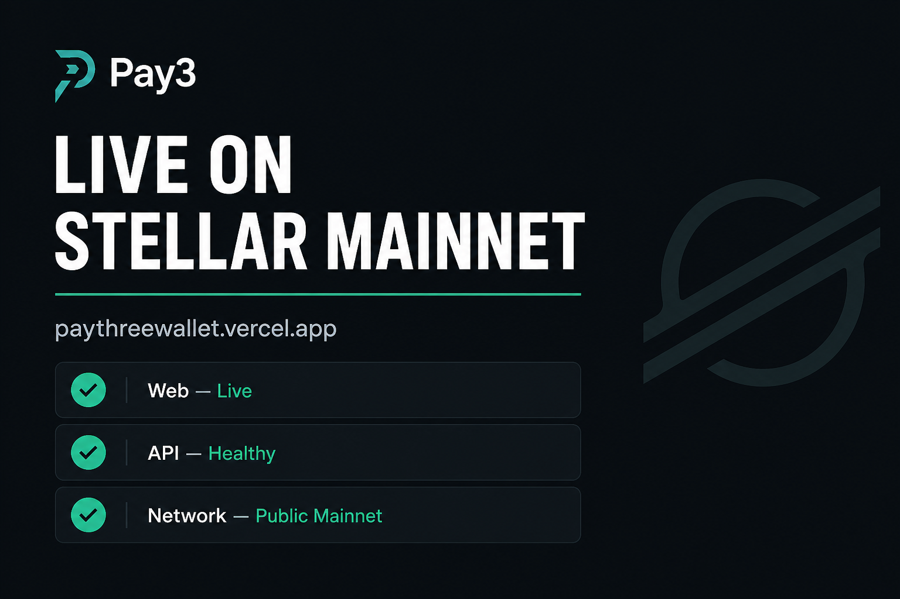

# Judge proof pack

Click-through materials for demos / viva. Cards below are for slides; **live links** are the source of truth.

## Visual cards

| Card | File |
|:-----|:-----|
| Live on mainnet |  |
| 10+ mainnet users |  |

## Verifiable live links

| Proof | URL |
|:------|:----|
| **Web (mainnet product)** | https://paythreewallet.vercel.app |
| **API health** | https://pay3-api.vercel.app/health |
| **Pitch deck** | [Google Slides](https://docs.google.com/presentation/d/1lIRI_BQ3Oz0NHWHPUerb9lBNeEy86r_FoH3Lmch54g8/edit?usp=sharing) |
| **Docs** | https://pay3.mintlify.site |
| **Repo** | https://github.com/debuuuuuu/PAY3 |
| **Contract CI** | https://github.com/debuuuuuu/PAY3/actions/workflows/smart-account.yml |
| **Mainnet Horizon** | https://horizon.stellar.org |
| **Explorer (public)** | https://stellar.expert/explorer/public |

### API health snapshot (checked 2026-07-25)

```json
{"ok":true,"service":"pay3-api","timestamp":"2026-07-25T17:51:38.015Z"}
```

## Traction claim

| Metric | Claim |
|:-------|:------|
| Mainnet users | Active Freighter wallets on production (legacy G-account jars) |
| Network | Public Global Stellar Network (mainnet) |
| Product path | Freighter → allocation jar → session → policy → MCP spend |

## On-chain / engineering proof (in-repo)

| Item | Where |
|:-----|:------|
| Zipper smart account | `contracts/smart-account/src/lib.rs` |
| 9 Rust auth tests | `contracts/smart-account/src/test.rs` |
| WASM hash (Zipper build) | `sha256:842c28f0f4db756cfbe259553993fd1045c0df32966b4bebff9d94720490e5e0` — see `docs/SOROBAN_SETUP.md` |
| Mainnet ops | `docs/PRODUCTION.md` |
| CI workflow | `.github/workflows/smart-account.yml` |

## Optional: paste real explorer proof here

Add files named like:

- `wallet-list-blur.png` — Neon / dashboard user list with addresses blurred  
- `tx-*.md` or screenshots — Horizon / [stellar.expert](https://stellar.expert/explorer/public) links for sample mainnet payments  

Template for a payment proof line:

```text
https://stellar.expert/explorer/public/tx/<TRANSACTION_HASH>
```
